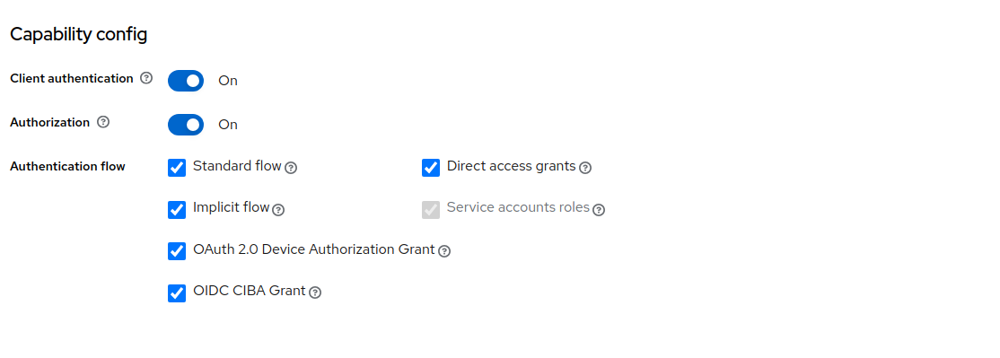
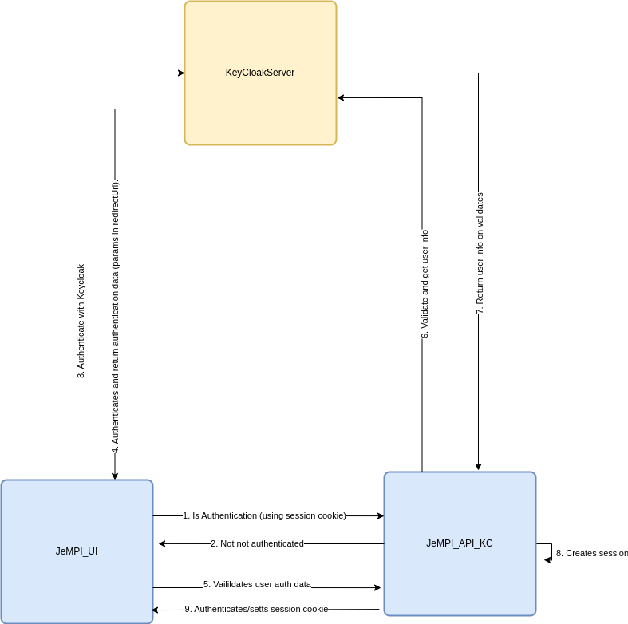
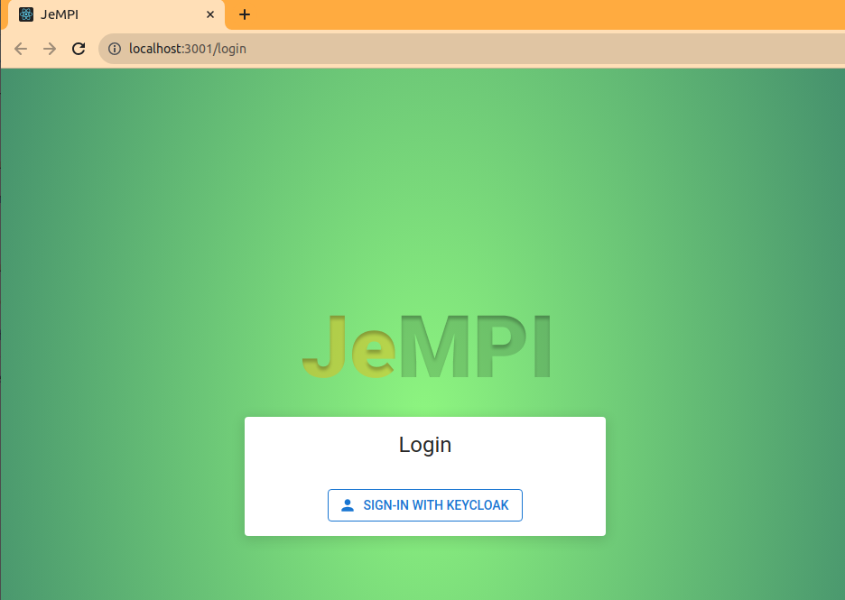
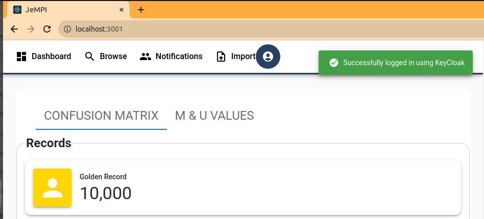

# JeMPI and Keycloak

This document is a guide of how JeMPI interfaces with keycloak for authentication. Will do this by covering

1. What keyclock is in general (with particular focus on aspects more linked to JeMPI)
2. How it integrates with JeMPI
3. How to configure it within JeMPI
4. How to configure JeMPI test keycloak server

## Keycloak?

Keycloak is an open source application that allows for users to sign into applications using single sign authentication. It manages that whole process including keeping all the relevant authentication data, and handling logging out. To find out more please see [https://www.keycloak.org/](https://www.keycloak.org/)

### Key aspects (relevant to JeMPI)

#### Realm

A realm is the highest structure in keycloak, and can be likened to an organization. Within a realm you configure, clients, users etc

#### Client

Clients are application/entities that can request keycloak to authenticate a user (see below), In theory multiple application can use the same client

**Important Note:**

For JeMPI to convert user session codes to user information, Client authentication must be enabled. This will result in the client getting a client secret you can use to query keycloak.

_Client -> Settings_

#### 

#### User

A user is someone that is registered on keycloak, and can authenticate via keycloak. Note: a user belongs to a realm but does not belong to a client. This means the same user can authenticate themselves using multiple clients (hence sso).

## How it integrates with JeMPI

## Configuring keycloak within JeMPI

To configure JeMPI you need to configure 4 main variable found in `_devops/linux/docker/conf/env/create-env-linux-high-1.sh_` / `devops/linux/docker/conf/env/create-env-linux-low-1.sh` . These are highlighted below detailing the purpose of each

<table>
  <tr>
   <td>Variable
   </td>
   <td>Description
   </td>
   <td>Default
   </td>
  </tr>
  
  <tr>
   <td>KC_API_URL 
   </td>
   <td>The url the API uses to access keycloak. When running in a docker swarm this could be the service host name (e.g http://keycloak-test-server:8080)
   </td>
   <td>
   </td>
  </tr>
  <tr>
   <td>KC_REALM_NAME
   </td>
   <td>The realm you want to use (as defined above)
   </td>
   <td>
   </td>
  </tr>
  <tr>
   <td>KC_JEMPI_CLIENT_ID
   </td>
   <td>The client you want to use (as defined above)
   </td>
   <td>
   </td>
  </tr>
  <tr>
   <td>KC_JEMPI_CLIENT_SECRET
   </td>
   <td>The client secret (as defined above)
   </td>
   <td>
   </td>
  </tr>
  <tr>
   <td>KC_JEMPI_ROOT_URL
   </td>
   <td>The url the request to authenticate will come from. In the case of JeMPI this is JeMPI UI’s url.  \
 \
Please note: this url is used to create the call back url, of which in JeMPI it is currently ${KC_JEMPI_ROOT_URL}/login
   </td>
   <td>
   </td>
  </tr>
</table>

In addition to this you will need to set JeMPI UI specific variables, these case also be found in `devops/linux/docker/conf/env/create-env-linux-high-1.sh` / devops/linux/docker/conf/env/create-env-linux-low-1.sh .

Do note: If you are not running JeMPI UI within the docker swarm, you will need to update the appropriate variables in the .env file of the JeMPI project before starting it.

<table>
  <tr>
   <td>Variable
   </td>
   <td>Description
   </td>
   <td>Default
   </td>
  </tr>
  <tr>
   <td>REACT_APP_JEMPI_BASE_API_HOST
   </td>
   <td>The domain on which JeMPI API is running.
   </td>
   <td>
   </td>
  </tr>
  <tr>
   <td>REACT_APP_JEMPI_BASE_API_PORT 
   </td>
   <td>The port on which JeMPI API is running.
   </td>
   <td>50000
   </td>
  </tr>
  <tr>
   <td>REACT_APP_MOCK_BACKEND
   </td>
   <td>Should be set to ‘false’ in most cases. Only enable for crude testing of JeMPI UI. Should be set to ‘false’ for Keycloak authentication
   </td>
   <td>false
   </td>
  </tr>
  <tr>
   <td>REACT_APP_ENABLE_SSO
   </td>
   <td>Should be set to ‘true’ for keycloak authentication 
   </td>
   <td>false
   </td>
  </tr>
  <tr>
   <td>KC_FRONTEND_URL 
   </td>
   <td>The url the ui will access keycloak from. In the case of keycloak running in docker with the port exposed it will be http://localhost:8080
   </td>
   <td>
   </td>
  </tr>
</table>

Once these variables are set up, you should be able to start JeMPI as normal and authentication should happen via keycloak. The workflow of this is represent pictorially below

1. _Login screen when  not authenticated_

2. _Logging in via keycloak_

3. _JeMPI once logged in_

## Configuring JeMPI test keycloak server

The above instructions assume you have a keycloak server already configured elsewhere. If not, JeMPI bundles a test version of keycloak which it uses. **Please note, the version is a development version, and should not be used in production.**

To use it:-

1. Update the JeMPI variable above to use the test server one. These are highlighted below. Note: By default these variables are already set correctly.

<table>
  <tr>
   <td>
KC_REALM_NAME
   </td>
   <td>jempi-dev
   </td>
  </tr>
  <tr>
   <td>KC_JEMPI_CLIENT_ID
   </td>
   <td>jempi-oauth
   </td>
  </tr>
  <tr>
   <td>KC_JEMPI_CLIENT_SECRET
   </td>
   <td>Nsuhj2lQiCgSE7eVPLBgnLEEeaijufeh
   </td>
  </tr>
  <tr>
   <td>KC_API_URL
   </td>
   <td>http://keycloak-test-server:8080
   </td>
  </tr>
  <tr>
   <td>KC_FRONTEND_URL
   </td>
   <td>http://localhost:8080
   </td>
  </tr>
  <tr>
   <td> KC_TEST_DB
   </td>
   <td>key_clock_test_db
   </td>
  </tr>
</table>

2. Start JeMPI normally. The key username details are below:

    **Username:** dev-user

    **Password:** dev-password

    The admin use for the keycloak server is 

    **Username:** admin

    **Password:** admin
